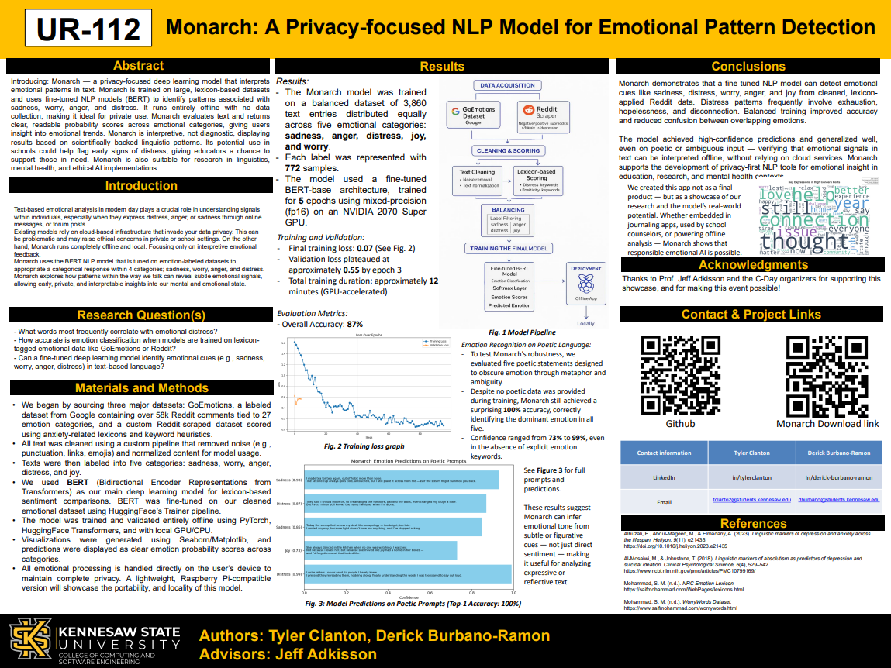

# Monarch — Locally Hosted AI for Emotional Pattern Detection

**Monarch** is a privacy-first, offline-capable NLP platform designed to detect emotional distress and behavioral patterns in written text. Built for accessibility, ethics, and usability, Monarch runs entirely on your device—no data collection, no internet required.
<p align="center">
  <a href="./Poster-UR-112.pdf">
    
  </a>
</p>

<p align="center"><strong>📄 Click the image above to view the full project poster (PDF)</strong><br>
Poster ID: UR-112 – <em>Monarch: A Privacy-focused NLP Model for Emotional Pattern Detection</em></p>

---

## Download

Installers for Linux and macOS are available at:

**[https://0θ.com/](https://0θ.com/0x02)**

> Includes `.deb` for Debian-based Linux systems and `.dmg` for macOS.

---

## The Mission

Monarch was built with one goal: to matter. Not just as a class project or research prototype—but as a real tool that could make a difference.  
Whether used by students, counselors, or individuals, Monarch is designed to help people better understand emotional patterns in their writing without compromising their privacy.  
All analysis happens offline. All data stays on your device. This is AI that respects you.

---

## Why It Matters

People express emotional distress in writing long before they say it out loud—through journals, essays, posts, and messages. These patterns often go unnoticed.  
Most analysis tools are cloud-based, invasive, or designed for enterprise settings. Monarch brings emotional NLP to everyday users—privately, locally, and accessibly.

---

## Core Features

- Offline-first design with zero data collection
- Fine-tuned BERT model for five emotional categories
- PDF, DOCX, and TXT support
- Custom radar charts, emotion gauges, and word clouds
- Streamlit frontend bundled with Electron for desktop use
- Runs on Raspberry Pi, macOS, and Linux desktops

---

## Technologies Used

- Python 3.11+
- PyTorch and HuggingFace Transformers
- Streamlit and Plotly
- Electron (for app bundling)
- Debian & macOS packaging (`.deb`, `.dmg`)

---

## Project Structure
```
MONARCH/
├── app/
│   └── app.py
├── data/
│   ├── processed/
│   │   ├── balanced/
│   │   │   └── balanced.json
│   │   ├── labeled_negative/
│   │   │   ├── find_imbalances.py
│   │   │   └── reddit_cleaned.json
│   │   └── positive/
│   │       ├── goemotions_cleaned.json
│   │       ├── reddit_positive_scored.json
│   │       └── reddit_scored.json
│   └── raw/
│       ├── external/
│       │   └── goemotions/
│       │       ├── emotions.txt
│       │       ├── test.tsv
│       │       ├── train.tsv
│       │       ├── dev.tsv
│       │       ├── positive_lexicons.txt
│       │       ├── worrywords.txt
│       │       └── reddit_*.json
│       ├── ekman_mapping.json
│       ├── scraper.py
│       └── scraper_positive.py
├── engine/
│   ├── apply_lexicons.py
│   ├── balance_data.py
│   ├── clean_positive.py
│   ├── clean_reddit_data.py
│   ├── cleaner.py
│   ├── goemotions_loader.py
│   ├── label_cleaner.py
│   ├── lexicons.py
│   ├── merge_goemotions.py
│   ├── model.py
│   └── positive_score.py
├── graphs/
│   ├── goemotions_labels.csv
│   ├── goemotions_labels.png
│   ├── label_distribution_summary.csv
│   ├── negative_reddit_labels.csv
│   ├── negative_reddit_labels.png
│   ├── positive_reddit_labels.csv
│   └── positive_reddit_labels.png
├── model/
│   ├── config.json
│   ├── tokenizer_config.json
│   ├── tokenizer.json
│   ├── vocab.txt
│   ├── model.safetensors
│   └── special_tokens_map.json
├── reports/
│   ├── analysis_logs.csv
│   ├── analyze_emotions.py
│   ├── dataset_understanding_graphs.py
│   ├── Diagram.jpg
│   ├── PRIOR2modern_emotion_heatmap.png
│   ├── PRIORenhanced_emotion_correlations.png
│   ├── PRIORimproved_anxiety_distribution.png
│   ├── PRIORimproved_emotion_flarebar.png
│   ├── PRIORimproved_subreddit_worry_levels.png
│   └── PRIORkey_expressions_wordcloud.png
├── train/
│   ├── test_backup.py
│   ├── test.py
│   └── train_model.py
├── loss_plot.png
├── requirements.txt
├── README.md
└── .gitignore
```
---

## Results

- **Dataset**: 3,860 samples (Reddit + GoEmotions), evenly distributed across:
  - **Sadness**, **Anger**, **Distress**, **Joy**, **Worry**, and **Neutral**
- **Model**: Fine-tuned BERT-base
- **Training**: 5 epochs, mixed-precision (`fp16`), trained on NVIDIA 2070 Super
- **Final Accuracy**: **87%**
- **Final training loss**: **0.07**

### Poetic Prompt Evaluation

Monarch was tested on ambiguous, metaphor-rich poetic prompts (not seen during training) and achieved **100% Top-1 accuracy**, confidently identifying the dominant emotion without relying on explicit keywords.  
Prediction confidence ranged from **73% to 99%**.

